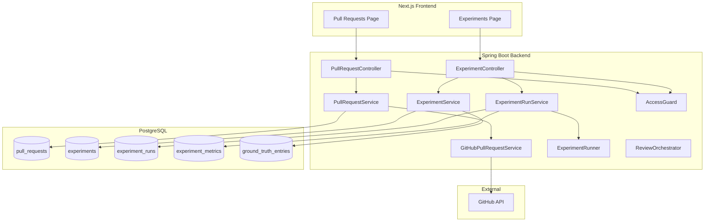
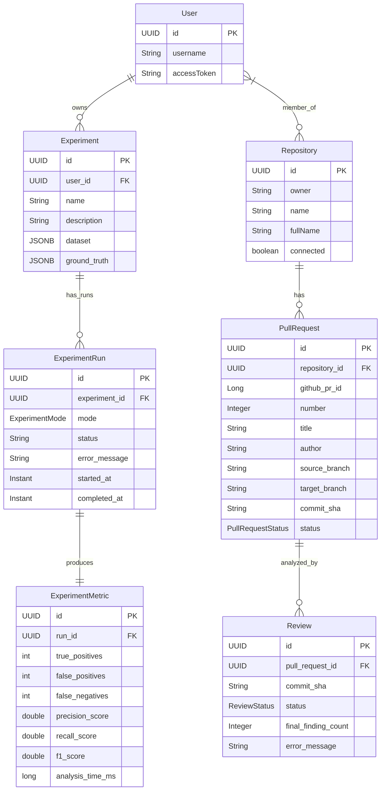

# Design Document: Pull Requests and Experiments

## Overview

This design makes two currently non-functional areas of DevSleuth work end-to-end:

1. **Pull Requests** — The list endpoint (`GET /api/repositories/{repoId}/pull-requests`) currently returns only locally-cached PRs (empty for a fresh repo). The fix wires `GitHubPullRequestService.listOpenPullRequests()` into the flow so PRs are fetched from GitHub, upserted locally, and returned. The existing `triggerAnalysis` and webhook paths already do this for individual PRs; the list path was simply missed.

2. **Experiments** — The `ExperimentRunner` exists with valid matching/metrics logic but is never invoked. The `Experiment` entity lacks user ownership and ground-truth storage. New CRUD endpoints, a run orchestration service, status tracking, and a reworked frontend page are needed.

Both areas share the existing authorization model (repository membership for PRs, user ownership for experiments) and the `@Async("analysisExecutor")` thread pool for long-running analysis.

## Architecture



### Design Decisions

| Decision | Rationale |
|----------|-----------|
| Fetch-and-upsert on list (not a background sync) | Keeps the system stateless between requests; avoids a scheduler and stale-cache logic. Fresh data every time the user opens the page. |
| Ground truth stored as a separate table, not JSON blob | Enables per-entry queries for debugging and future per-file metrics breakdown. |
| Experiment runs use same `@Async("analysisExecutor")` pool | Reuses existing thread pool config and monitoring. Experiments are infrequent; no dedicated pool needed. |
| `ExperimentRun` gains a `status` + `errorMessage` column | Mirrors `Review` entity pattern for consistency. Status is polled by frontend. |
| No WebSocket for status updates | The frontend already polls. SPA polling at 3s intervals is adequate for low-frequency experiment runs. Adding WebSocket for one feature would be over-engineering. |

## Components and Interfaces

### Backend Changes

#### 1. `PullRequestService.listByRepository` (modified)

Current: `return pullRequestRepository.findByRepositoryIdOrderByCreatedAtDesc(repositoryId);`

New behavior:
```java
public List<PullRequest> listByRepository(UUID repositoryId, User user) {
    Repository repo = repositoryService.findById(repositoryId)
            .orElseThrow(() -> new RuntimeException("Repository not found"));

    List<GitHubPRInfo> ghPRs = gitHubPullRequestService
            .listOpenPullRequests(repo.getOwner(), repo.getName(), user.getAccessToken());

    for (GitHubPRInfo info : ghPRs) {
        upsertPullRequest(repo, info);
    }

    return pullRequestRepository.findByRepositoryIdOrderByCreatedAtDesc(repositoryId);
}
```

The `upsertPullRequest` helper already exists inline in `triggerAnalysis` and `handleWebhookPR`. Extract it to a private method and reuse across all three call sites.

#### 2. `PullRequestController.list` (modified)

Pass `User` to the service method so it can resolve the access token for the GitHub call.

Add `latestReview` data to the response DTO for requirement 2.2/2.3.

#### 3. `PullRequestResponse` DTO (extended)

Add fields:
```java
public record PullRequestResponse(
        UUID id, int number, String title, String author,
        String sourceBranch, String targetBranch, String commitSha, String status,
        LatestReviewInfo latestReview  // nullable
) { ... }

public record LatestReviewInfo(UUID reviewId, String status, Integer finalFindingCount) {}
```

#### 4. `ExperimentService` (new)

Handles CRUD for experiments:
```java
@Service
public class ExperimentService {
    Experiment create(ExperimentCreateRequest req, User user);
    List<Experiment> listByUser(UUID userId);
    Optional<Experiment> findByIdAndUser(UUID id, UUID userId);
}
```

#### 5. `ExperimentRunService` (new)

Orchestrates experiment execution:
```java
@Service
public class ExperimentRunService {
    ExperimentRun startRun(UUID experimentId, ExperimentMode mode, User user);
    Optional<ExperimentRun> getRunStatus(UUID runId);
}
```

The `startRun` method:
1. Validates experiment ownership.
2. Creates an `ExperimentRun` with status `RUNNING`.
3. Delegates to `@Async` method that calls `ExperimentRunner.run()`.
4. On completion: persists `ExperimentMetric`, sets status to `COMPLETED`.
5. On failure: sets status to `FAILED` with error message.

#### 6. `ExperimentController` (extended)

New endpoints:
| Method | Path | Description |
|--------|------|-------------|
| POST | `/api/experiments` | Create experiment |
| GET | `/api/experiments` | List user's experiments |
| GET | `/api/experiments/{id}` | Get single experiment |
| POST | `/api/experiments/{id}/runs` | Start a run (body: `{mode}`) |
| GET | `/api/experiments/{id}/runs` | List runs for experiment |
| GET | `/api/experiments/runs/{runId}` | Get run status + metrics |
| GET | `/api/experiments/results` | All metrics (existing, kept for backward compat) |

All endpoints enforce authentication and ownership scoping.

#### 7. `ExperimentRunner` SLF4J fix

Current (broken):
```java
log.info("Experiment [{}]: TP={}, FP={}, FN={}, P={:.3f}, R={:.3f}, F1={:.3f}, time={}ms",
        mode, tp, fp, fn, metrics.precision(), metrics.recall(), metrics.f1(), elapsed);
```

Fixed:
```java
log.info("Experiment [{}]: TP={}, FP={}, FN={}, P={}, R={}, F1={}, time={}ms",
        mode, tp, fp, fn, metrics.precision(), metrics.recall(), metrics.f1(), elapsed);
```

SLF4J uses `{}` as positional placeholders. Format specifiers like `{:.3f}` are invalid and cause logging failures.

### Database Changes (Flyway migration)

#### Modify `experiments` table

```sql
ALTER TABLE experiments ADD COLUMN user_id UUID NOT NULL REFERENCES users(id);
ALTER TABLE experiments ADD COLUMN ground_truth JSONB;
```

`ground_truth` stores a JSON array of `GroundTruthEntry` objects. While a separate table would allow per-entry queries, the ground truth is always read/written as a unit, and JSONB with GIN indexing is sufficient for the current scale.

> Design note: if per-entry querying becomes needed, a `ground_truth_entries` table can be added later without breaking the API contract.

#### Modify `experiment_runs` table

```sql
ALTER TABLE experiment_runs ADD COLUMN status VARCHAR(20) NOT NULL DEFAULT 'RUNNING';
ALTER TABLE experiment_runs ADD COLUMN error_message TEXT;
```

Status values: `RUNNING`, `COMPLETED`, `FAILED`.

#### Modify `experiments.dataset`

The existing `dataset` column (VARCHAR) needs to hold structured file-change data. Change to JSONB:

```sql
ALTER TABLE experiments ALTER COLUMN dataset TYPE JSONB USING dataset::jsonb;
```

### Frontend Changes

#### Pull Requests Page (modified)

- Add `targetBranch` column to the table.
- Add `latestReview` display: show status badge and finding count, or "Not analyzed" text.
- Error handling: catch API errors and show inline error message instead of silently clearing PRs.
- Already has loading indicator and empty state (requirements 1.5, 1.6 satisfied).

#### Experiments Page (rewritten)

Current page only displays metrics. New page adds:

1. **Experiment list** — shows user's experiments with name and run count.
2. **Create experiment form** — name, dataset (JSON file upload or paste), ground truth entries.
3. **Experiment detail view** — shows dataset summary, ground truth, and list of runs.
4. **Run controls** — "Run" button with mode selector (STATIC_ONLY / AI_ONLY / HYBRID).
5. **Status polling** — 3-second interval poll on active runs, stop when COMPLETED/FAILED.
6. **Results comparison** — existing bar chart + table (already implemented), now populated with real data grouped by mode.

#### New TypeScript types

```typescript
export interface Experiment {
  id: string;
  name: string;
  description: string | null;
  datasetSummary: { fileCount: number };
  groundTruthCount: number;
  createdAt: string;
}

export interface ExperimentRun {
  id: string;
  experimentId: string;
  mode: "STATIC_ONLY" | "AI_ONLY" | "HYBRID";
  status: "RUNNING" | "COMPLETED" | "FAILED";
  errorMessage: string | null;
  startedAt: string;
  completedAt: string | null;
}

export interface ExperimentMetrics {
  runId: string;
  mode: "STATIC_ONLY" | "AI_ONLY" | "HYBRID";
  truePositives: number;
  falsePositives: number;
  falseNegatives: number;
  precisionScore: number;
  recallScore: number;
  f1Score: number;
  analysisTimeMs: number;
}
```

#### New API client methods

```typescript
experiments: {
  list: () => get<Experiment[]>("/experiments"),
  get: (id: string) => get<Experiment>(`/experiments/${id}`),
  create: (body: ExperimentCreateRequest) => post<Experiment>("/experiments", body),
  startRun: (id: string, mode: string) => post<ExperimentRun>(`/experiments/${id}/runs`, { mode }),
  getRuns: (id: string) => get<ExperimentRun[]>(`/experiments/${id}/runs`),
  getRunStatus: (runId: string) => get<ExperimentRun>(`/experiments/runs/${runId}`),
  getResults: () => get<ExperimentMetrics[]>("/experiments/results"),
}
```

## Data Models

### Entity Relationship Diagram



### Request/Response DTOs

**ExperimentCreateRequest:**
```java
public record ExperimentCreateRequest(
    @NotBlank String name,
    String description,
    @NotEmpty List<FileChangeDto> dataset,
    @NotEmpty List<GroundTruthEntryDto> groundTruth
) {}

public record FileChangeDto(
    @NotBlank String filename,
    @NotBlank String status,  // added, modified, deleted
    String patch
) {}

public record GroundTruthEntryDto(
    @NotBlank String filePath,
    @NotNull Integer lineStart,
    Integer lineEnd,
    @NotNull FindingCategory category,
    Severity severity,
    String title
) {}
```

**ExperimentRunResponse:**
```java
public record ExperimentRunResponse(
    UUID id,
    UUID experimentId,
    ExperimentMode mode,
    String status,
    String errorMessage,
    Instant startedAt,
    Instant completedAt,
    ExperimentMetricResponse metrics  // nullable, populated when COMPLETED
) {}
```

## Correctness Properties

*A property is a characteristic or behavior that should hold true across all valid executions of a system — essentially, a formal statement about what the system should do. Properties serve as the bridge between human-readable specifications and machine-verifiable correctness guarantees.*

### Property 1: PR upsert preserves all fields

*For any* valid `GitHubPRInfo` (with non-null number, title, author, source branch, target branch, commit SHA, and state), upserting it into the local database and then querying by repository ID and number SHALL yield an entity whose fields exactly match the input info.

**Validates: Requirements 1.2**

### Property 2: PR row rendering completeness

*For any* `PullRequestResponse` object with non-null fields, rendering it as a table row SHALL produce output containing the PR number, title, author, target branch, and status.

**Validates: Requirements 2.1**

### Property 3: Reviews ordered by recency

*For any* set of reviews belonging to a pull request, the list returned by the reviews endpoint SHALL be ordered such that for consecutive elements `reviews[i]` and `reviews[i+1]`, `reviews[i].createdAt >= reviews[i+1].createdAt`.

**Validates: Requirements 4.1**

### Property 4: Experiment persistence round-trip

*For any* valid `ExperimentCreateRequest` (non-blank name, non-empty dataset, non-empty ground truth), creating an experiment and then fetching it by ID SHALL yield an experiment whose name, dataset file count, and ground-truth entry count match the original request.

**Validates: Requirements 5.1**

### Property 5: Invalid experiment input rejected

*For any* `ExperimentCreateRequest` where name is blank, or dataset is empty, or groundTruth is empty, the system SHALL reject with HTTP 400 and SHALL NOT persist an experiment.

**Validates: Requirements 5.2**

### Property 6: Experiment ownership scoping

*For any* user, listing experiments SHALL return only experiments where `experiment.userId` equals the requesting user's ID. No experiment owned by a different user SHALL appear in the results.

**Validates: Requirements 5.4**

### Property 7: Metrics computation correctness

*For any* non-negative integers `tp`, `fp`, `fn` where `tp + fp > 0` and `tp + fn > 0`, `EvaluationMetrics.compute(tp, fp, fn, timeMs)` SHALL produce values satisfying:
- `precision == tp / (tp + fp)`
- `recall == tp / (tp + fn)`
- `f1 == 2 * precision * recall / (precision + recall)`
- `analysisTimeMs == timeMs`

**Validates: Requirements 6.2**

### Property 8: Results comparison rendering completeness

*For any* non-empty list of `ExperimentMetrics` objects, the rendered comparison view SHALL display precision, recall, F1, and analysis time for each entry.

**Validates: Requirements 8.1**

## Error Handling

| Scenario | Behavior |
|----------|----------|
| GitHub API returns 401 (bad token) | `PullRequestService` catches exception, wraps in `DevSleuthException(HTTP 502, "GitHub authentication failed. Reconnect your repository.")` |
| GitHub API returns 404 (repo deleted/renamed) | Service throws `DevSleuthException(HTTP 502, "Repository not found on GitHub.")` |
| GitHub API network timeout | Spring's RestTemplate timeout triggers; service catches and returns `DevSleuthException(HTTP 502, "GitHub is unreachable. Try again later.")` |
| No access token available for user | Service checks before calling GitHub; throws `DevSleuthException(HTTP 400, "No GitHub access token. Please re-authenticate.")` |
| Experiment run analysis failure | `ExperimentRunService` catches any exception in the `@Async` method, sets run status to `FAILED`, persists error message. No exception propagates to caller. |
| Experiment creation with invalid JSON dataset | Bean Validation rejects at controller level with 400 + field-level error messages. |
| Unauthenticated request to any new endpoint | Existing Spring Security filter chain returns 401 before reaching controller. |
| Non-member accessing repository resources | `AccessGuard.requireRepository()` throws 404. |

Frontend error handling:
- API client `get`/`post` helpers already throw on non-2xx. Pages catch errors and display inline error messages.
- Experiments page: show toast/banner on run failure with the `errorMessage` from the run status response.
- Pull Requests page: currently swallows errors with `catch(() => setPrs([]))`. Fix to show error message.

## Testing Strategy

### Unit Tests

- **`EvaluationMetrics.compute()`** — verify precision/recall/F1 formulas, edge cases (all zeros, perfect score, no findings).
- **`ExperimentRunner.matches()`** — verify file path matching, line tolerance, category matching.
- **`PullRequestService.upsertPullRequest()`** — verify insert vs update behavior.
- **Validation DTOs** — verify `@NotBlank`, `@NotEmpty`, `@NotNull` constraints fire correctly.
- **Frontend components** — render tests for PR table row, experiment list, metrics comparison.

### Property-Based Tests

Library: **jqwik** (already standard for Spring Boot PBT, integrates with JUnit 5).

Each property test runs a minimum of **100 iterations** with randomized inputs.

| Property | Test target | Generator strategy |
|----------|------------|-------------------|
| Property 7 (metrics correctness) | `EvaluationMetrics.compute()` | Random non-negative int triples (tp, fp, fn) + random timeMs |
| Property 5 (invalid experiment rejected) | `ExperimentService.create()` | Generate requests with one or more fields blanked/emptied |
| Property 1 (upsert round-trip) | `PullRequestService.upsertPullRequest()` | Random `GitHubPRInfo` records with valid field values |
| Property 3 (review ordering) | `ReviewRepository` query | Insert N reviews with random timestamps, verify returned order |
| Property 6 (ownership scoping) | `ExperimentService.listByUser()` | Create experiments for multiple random users, verify isolation |

Tag format: `// Feature: pull-requests-and-experiments, Property 7: Metrics computation correctness`

### Integration Tests

- **PR list endpoint**: Mock GitHub API, verify fetch → upsert → return cycle.
- **Analyze endpoint**: Verify QUEUED review creation and async handoff.
- **Experiment CRUD endpoints**: Create, list, get with auth.
- **Experiment run lifecycle**: Start → poll RUNNING → COMPLETED with metrics.
- **Authorization**: Verify 404 for non-member repo access and non-owner experiment access.
- **401 for unauthenticated**: All new endpoints.

### Frontend Tests

- Component render tests for updated PR table (target branch, latest review columns).
- Experiments page: create form validation, run controls, polling behavior, error display.
- Empty states for both pages.
